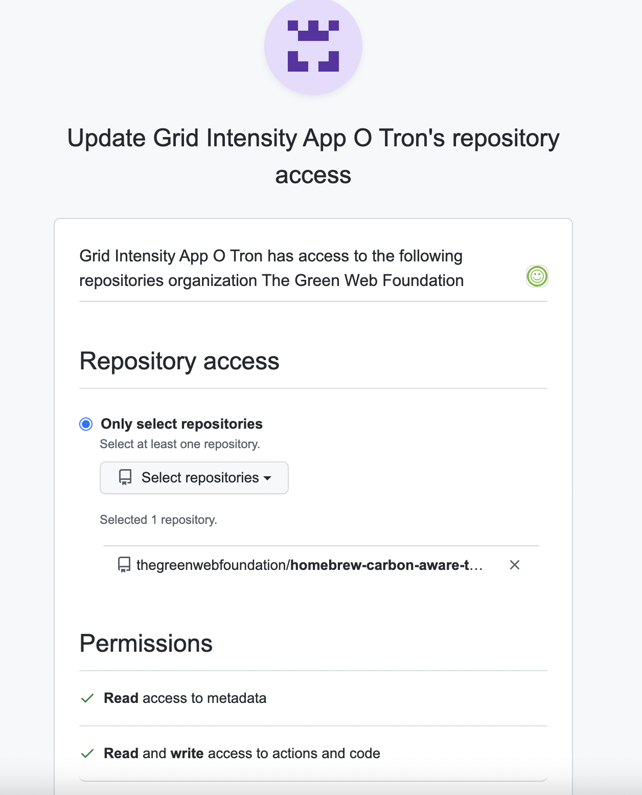

# Homebrew Setup

The homebrew tap is located at https://github.com/thegreenwebfoundation/homebrew-carbon-aware-tools

## Permissions

The GoReleaser GitHub Action uses the secrets `HOMEBREW_TAP_GITHUB_APP_ID` and
`HOMEBREW_TAP_GITHUB_APP_PEM` to generate an installation token which
expires after 1 hour.

This is used to authenticate with the GitHub API when publishing to the 
`homebrew-carbon-aware-tools` repo.

To restrict access to just this repo a GitHub App has been created that can
write to this repo.

## Setup

- The GitHub App is named `Grid Intensity App O Tron` and can be found in
the settings of the `thegreenwebfoundation` organization.


- To create the installation token we need to create a [private key](https://docs.github.com/en/developers/apps/building-github-apps/authenticating-with-github-apps)
for the app. (This can be found in 1 Password).


- The app needs to be installed in the `thegreenwebfoundation` org for just the
`grid-intensity-go` repository.




- Authenticate as the GitHub App using the private key and create a JWT token
using the Ruby script on this page. 
https://docs.github.com/en/developers/apps/building-github-apps/authenticating-with-github-apps#authenticating-as-a-github-app

- Get the installation ID for the app for the grid-intensity-go repo.

```
 curl \
  -H "Accept: application/vnd.github.v3+json" \
  -H "Authorization: Bearer ***JWT TOKEN***" \
  -s https://api.github.com/app/installations | jq '.[0].id'

26614624
```

- Add a secret named `HOMEBREW_TAP_GITHUB_APP_ID` with the installation ID above.


- Add a secret named `HOMEBREW_TAP_GITHUB_APP_PEM` with the base 64 encoded
private key.

```
base64 private-key.pem
```

https://dev.to/dtinth/authenticating-as-a-github-app-in-a-github-actions-workflow-27co
