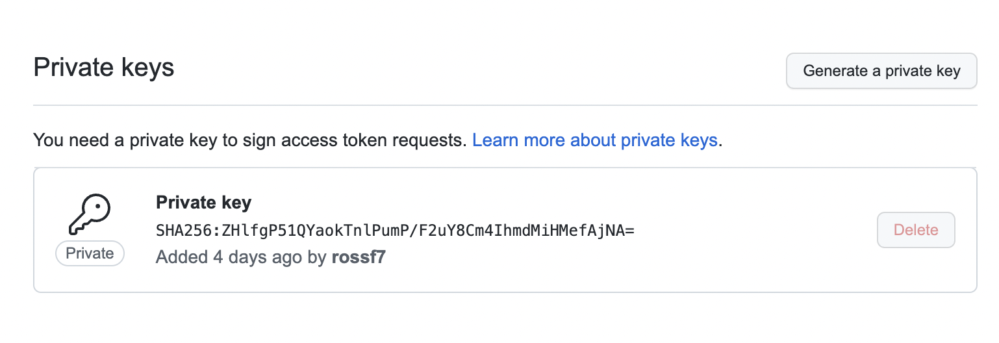
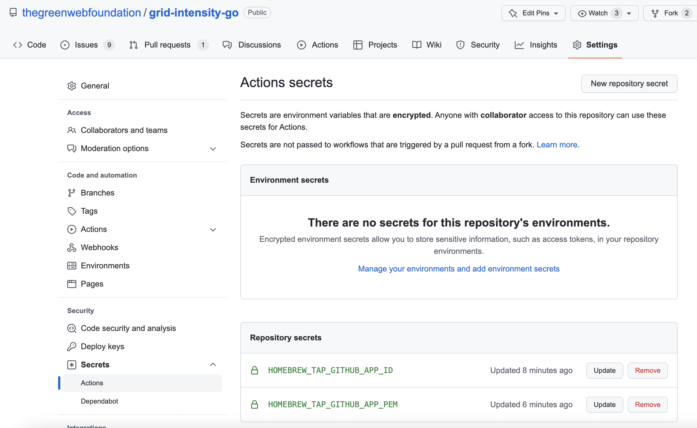

# Homebrew Setup

The homebrew tap is located at https://github.com/thegreenwebfoundation/homebrew-carbon-aware-tools

## Permissions

The GoReleaser GitHub Action uses the secrets `HOMEBREW_TAP_GITHUB_APP_ID` and
`HOMEBREW_TAP_GITHUB_APP_PEM` to generate an installation token which
expires after 1 hour.

This is used to authenticate with the GitHub API when publishing to the 
`homebrew-carbon-aware-tools` repo.

To restrict access to just this repo a GitHub App has been created that can
write to this repo.

## Setup

- The GitHub App is named `Grid Intensity App O Tron` and can be found in
the settings of the `thegreenwebfoundation` organization.

- To create the installation token we need to create a [private key](https://docs.github.com/en/developers/apps/building-github-apps/authenticating-with-github-apps)
for the app. (This can be found in 1 Password).

- The app needs to be installed in the `thegreenwebfoundation` org for just the
`grid-intensity-go` repository.

- Add a secret named `HOMEBREW_TAP_GITHUB_APP_ID` with the app ID.

- Add a secret named `HOMEBREW_TAP_GITHUB_APP_PEM` with the full contents of the
private key file. Note: This file should NOT be base64 encoded.

